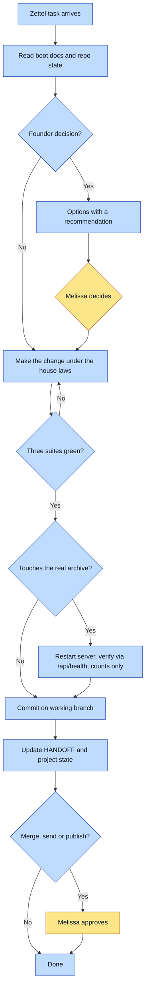

# Purpose
A change to Zettel lands working on the real archive, with no message content
crossing any boundary, and the project left with a written next action, so the
app moves toward ten real users on their own archives.

# When to use (Trigger)
Melissa mentions Zettel, zetl.ink, the Z layer, resonance, the demo, or a
shipping blocker, or asks to change, run, verify or ship anything in the Zettel repo.

# Inputs / Prerequisites
- The repo at ~/zettel, with HANDOFF.md and SHIPPING.md read.
- The project STATE.md in the workspace for the current next action.
- Full Disk Access on whatever process runs serve.py, for real-archive checks.
- Python 3 and Node for the three test suites.

# Roles
| Role | Responsibility |
|---|---|
| **Human operator** | The license, closure vs excavation, consumer vs enterprise, hero copy, who the ten users are, anything sent, published or merged to main |
| **Agent executor** | Reading the boot docs, code changes, running the suites, real-archive checks through /api/health, SHIPPING items with an obvious answer, state and handoff updates, commits on the working branch |

# Procedure
1. Read HANDOFF.md, SHIPPING.md, the project STATE.md, and the repo's branch and status.
2. If the task touches visuals, load living-paper; if it needs browser checks, load browser-verification-craft.
3. If the task is a founder decision, lay out the options with a recommendation and stop.
4. Make the change, keeping every house law: content-blind routes, read-only archive, no content column, absent not inert, one hue and no shadows, two-tap covenant, honest claims.
5. Run the client, serve.py and server suites. If any fails, fix it before going on.
6. If the change affects the real archive, restart serve.py, open a fresh tab, and verify through /api/health with counts only.
7. If a SHIPPING item was completed, tick it in the same commit.
8. Commit on the working branch, update HANDOFF State if what is live changed, and write the project state line.

# Process Flowchart
Amber = irreducibly human. Blue = agent-executed or agent-proposed.

# Done / Verification
All three suites pass with their real output reported; a real-archive change is
confirmed through /api/health; no route, log, fixture or report carries message
text; the commit is on the working branch; STATE.md has a dated line and a
next action that is not already done.

# Exceptions & Troubleshooting
- Works on the demo but not the real archive: an old serve.py or old tab. Restart and open fresh before debugging.
- /api/health shows no archive access: the running process lacks Full Disk Access. Say which binary needs it; do not grant Terminal broadly.
- Autostart runs but cannot read: a launchd job does not inherit Terminal's grant; Zettel-Autostart.command prints the interpreter path that needs its own.
- A needed verb (send, summon, scribe) is missing: it lives in the read-only ancestor repo. Recover it into ~/zettel; keep the 501 until then.
- Branch confusion: PR #1 may or may not have merged. Check `git log main` before choosing a base.

# Automation Opportunities
Already automatic: CI runs the three suites and the synthetic-number sweep.
Strongest next candidate: one script that runs all three suites and the
/api/health check together, so every run verifies the same way. Must stay
human: every founder decision above, and anything that reaches another person,
because the product's whole promise rests on her judgment about other
people's messages.

# Related
- report-a-zettel-bug, in ~/zettel/.claude/skills, for filing bugs without leaking the archive
- wavelength, for the read-only ancestor repo

# Revision History

| Version | Date | Changes |
|---|---|---|
| 0.1 | 2026-09-23 | Initial draft, derived from HANDOFF.md, SHIPPING.md and SECURITY.md. |
